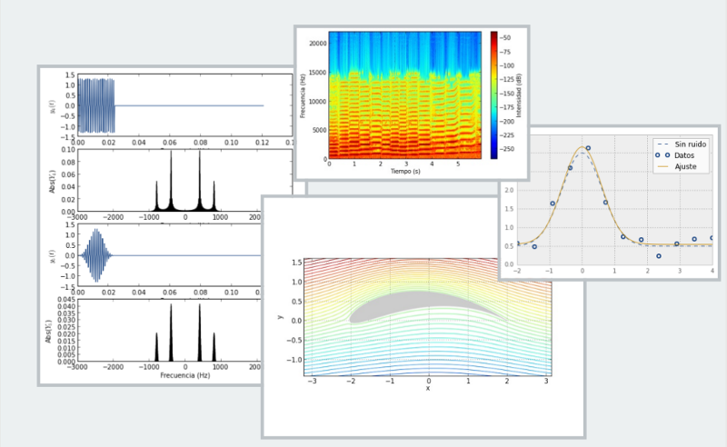
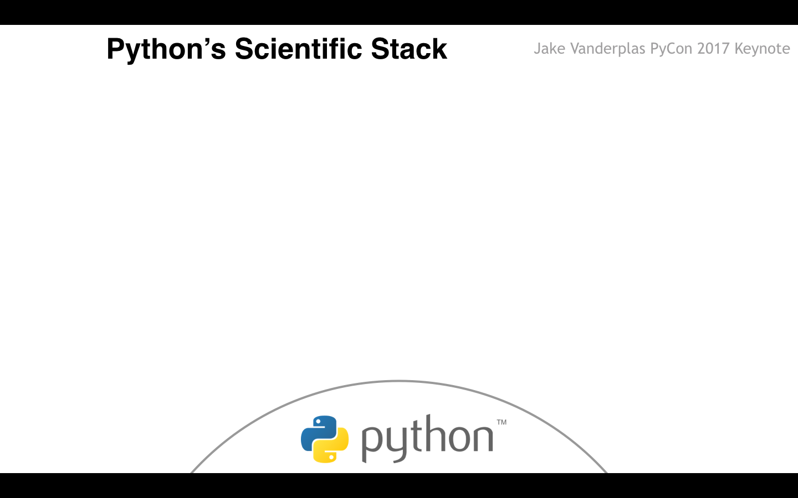
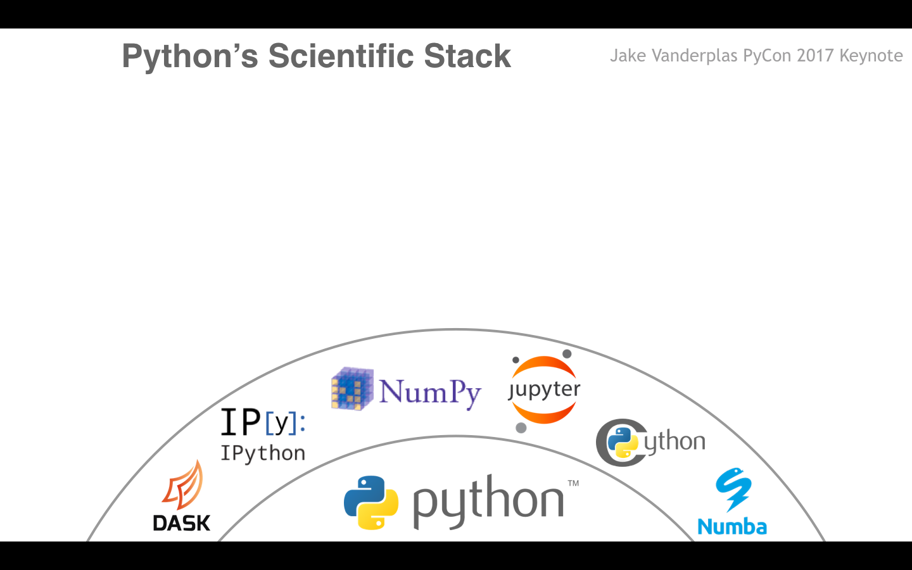
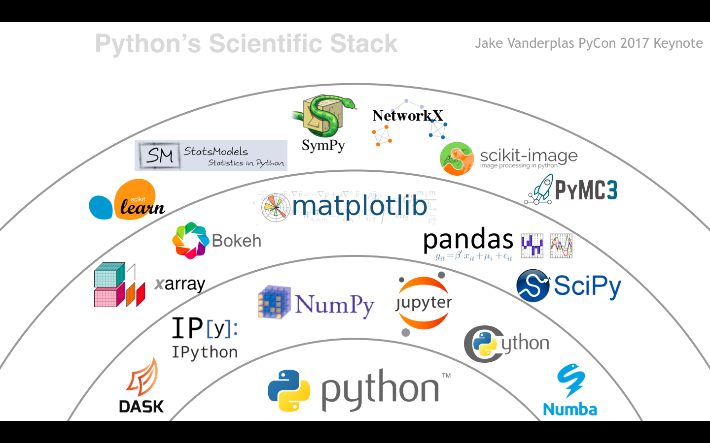

---
jupyter:
  jupytext:
    text_representation:
      extension: .md
      format_name: markdown
      format_version: '1.3'
      jupytext_version: 1.11.1
  kernelspec:
    display_name: Python 3
    language: python
    name: python3
---

<!-- #region slideshow={"slide_type": "slide"} -->
# Herramientas Open Source para resolver ecuaciones y procesos Científicos de manera ágil



## Juan Luis Cano Rodríguez

## 2021-04-08 @ UNSA
<!-- #endregion -->

<!-- #region slideshow={"slide_type": "slide"} -->
# Índice

1. Presentación
2. Análisis numérico con SciPy
3. Cálculo simbólico con SymPy
4. Conclusiones
5. Preguntas
<!-- #endregion -->

<!-- #region slideshow={"slide_type": "notes"} -->
1. Presentación (5m)
2. Análisis numérico con SciPy (12m)
3. Cálculo simbólico con SymPy (12m)
4. Conclusiones (1m)
5. Preguntas
<!-- #endregion -->

<!-- #region slideshow={"slide_type": "slide"} -->
# ¿Quién soy yo?


* **Ingeniero Aeronáutico** y pythonista autodidacta de Madrid 🇪🇸
* **Defensor del Desarrollador** (_Developer Advocate_) en Read the Docs 🥑
* **Socio fundador y ex-presidente** de la Asociación Python España y organizador de PyConES por 7 años 🐍
* **Colaborador** en proyectos de Python Científico: NumPy, SciPy, conda, astropy, poliastro, memory-profiler...
* **Profesor asociado** en **IE** y **ESADE** de Python para Big Data
* Amante del código abierto y el hard rock 🤘

<!-- #endregion -->

<!-- #region slideshow={"slide_type": "slide"} -->
# Ecosistema Python científico


<!-- #endregion -->

<!-- #region slideshow={"slide_type": "subslide"} -->
# Ecosistema Python científico


<!-- #endregion -->

<!-- #region slideshow={"slide_type": "subslide"} -->
# Ecosistema Python científico


<!-- #endregion -->

<!-- #region slideshow={"slide_type": "subslide"} -->
# Ecosistema Python científico


<!-- #endregion -->

<!-- #region slideshow={"slide_type": "slide"} -->
# Análisis numérico con SciPy


Biblioteca genérica de cálculo científico. Versión 1.6.2 https://docs.scipy.org/doc/scipy/reference/

- `scipy.linalg`: álgebra lineal con ATLAS, LAPACK, y BLAS
- `scipy.stats`: distribuciones, funciones estadísticas...
- `scipy.integrate`: cuadratura de funciones, integración de EDOs
- `scipy.optimization`: optimización local y global, ajuste, búsqueda de raíces...
- `scipy.interpolate`: interpolación, _splines_...
- `scipy.fftpack`: transformaciones rápidas de Fourier
- `scipy.signal`: procesamiento de señal
- `scipy.special`: funciones especiales
- `scipy.io`: lectura y escritura de formatos científicos
<!-- #endregion -->

<!-- #region slideshow={"slide_type": "subslide"} -->
## Ejemplo: Ecuación de Kepler

La ecuación de Kepler

$$M = E - e \sin E$$

que relaciona dos parámetros geométricos de las órbitas elípticas, la anomalía media $M$ y la anomalía excéntrica $E$.


para los siguientes valores de excentricidad:

* Tierra: $0.0167$
* Plutón: $0.249$
* Cometa Holmes: $0.432$
* 28P/Neujmin: $0.775$
* Cometa Halley: $0.967$
<!-- #endregion -->

<!-- #region slideshow={"slide_type": "subslide"} -->
En primer lugar, definimos la función correspondiente a:

$$ F(E; e, M) \equiv M - E - e \sin{E} = 0 $$
<!-- #endregion -->

```python slideshow={"slide_type": "fragment"}
import numpy as np

def F(E, e, M):
    return M - E + e * np.sin(E)
```

<!-- #region slideshow={"slide_type": "subslide"} -->
En segundo lugar, importamos el subpaquete necesario de SciPy:
<!-- #endregion -->

```python slideshow={"slide_type": "fragment"}
from scipy import optimize
```

<!-- #region slideshow={"slide_type": "subslide"} -->
Y, en tercer lugar, utilizaremos la función `root_scalar`, que busca raíces en funciones univariantes, para resolver el caso $e = 0.0167$, $M = 0.3$:
<!-- #endregion -->

```python slideshow={"slide_type": "fragment"}
optimize.root_scalar(F, args=(0.0167, 0.3), method="secant", x0=0.3, x1=0.2)
```

<!-- #region slideshow={"slide_type": "slide"} -->
# Cálculo simbólico con SymPy


Biblioteca para cálculo simbólico. Versión 1.7.1 https://docs.sympy.org/

- Operaciones elementales
- Simplificación algebraica
- Series de potencias
- Ecuaciones algebraicas, diferenciales, polinómicas, diofantinas
- Generación de código
- Teoría de números
- Matrices
- Integrales
- Geometría
- Física
- ¡Y más!
<!-- #endregion -->

<!-- #region slideshow={"slide_type": "subslide"} -->
## Ejemplo: Derivación

Calcular las derivadas con respecto a $x$ e $y$ de la ecuación:

$$ x^{2} \cos{\left (y \right )} + y^{3} \sin^{2}{\left (x \right )} $$
<!-- #endregion -->

<!-- #region slideshow={"slide_type": "subslide"} -->
En primer lugar, importamos SymPy:
<!-- #endregion -->

```python slideshow={"slide_type": "fragment"}
from sympy import init_printing, symbols, diff, sin, cos
```

<!-- #region slideshow={"slide_type": "subslide"} -->
En segundo lugar, inicializamos la presentación matemática de las expresiones:
<!-- #endregion -->

```python slideshow={"slide_type": "fragment"}
init_printing()
```

<!-- #region slideshow={"slide_type": "subslide"} -->
En tercer lugar, definimos nuestras variables simbólicas usando la función `symbols`:
<!-- #endregion -->

```python slideshow={"slide_type": "fragment"}
x, y = symbols("x, y")
x, y
```

<!-- #region slideshow={"slide_type": "subslide"} -->
A continuación, definimos nuestra expresión:
<!-- #endregion -->

```python slideshow={"slide_type": "fragment"}
expr_xy = y ** 3 * sin(x) ** 2 + x ** 2 * cos(y)
expr_xy
```

<!-- #region slideshow={"slide_type": "subslide"} -->
Y finalmente, calculamos las derivadas usando la función `diff`:
<!-- #endregion -->

```python slideshow={"slide_type": "fragment"}
diff(expr_xy, x)
```

```python slideshow={"slide_type": "fragment"}
diff(expr_xy, x, 2, y, 3)
```

<!-- #region slideshow={"slide_type": "subslide"} -->
También podemos integrar:
<!-- #endregion -->

```python slideshow={"slide_type": "fragment"}
from sympy import integrate, pi
```

```python slideshow={"slide_type": "fragment"}
integrate(expr_xy, x)
```

```python slideshow={"slide_type": "fragment"}
integrate(expr_xy, (x, -pi, pi))
```

<!-- #region slideshow={"slide_type": "slide"} -->
# Conclusiones

- Python es más que un lenguaje: es un **ecosistema**
- SciPy y SymPy son dos piezas de ese ecosistema
- **SciPy** brinda herramientas de análisis numérico
- **SymPy** ofrece, por contra, cálculo simbólico, más parecido al que operan los humanos
<!-- #endregion -->

<!-- #region slideshow={"slide_type": "slide"} -->
# ¿Preguntas?


- ¡Escríbeme un email! <hello@juanlu.space>
- Material de la charla: https://github.com/astrojuanlu/charla-scipy-sympy
<!-- #endregion -->
