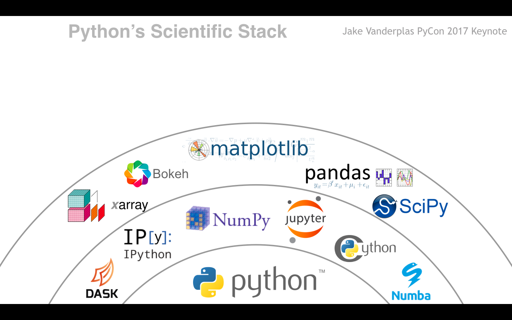

---
jupyter:
  jupytext:
    text_representation:
      extension: .md
      format_name: markdown
      format_version: '1.3'
      jupytext_version: 1.11.1
  kernelspec:
    display_name: Python 3
    language: python
    name: python3
---

<!-- #region slideshow={"slide_type": "slide"} -->
# Herramientas Open Source para resolver ecuaciones y procesos Científicos de manera ágil

## Juan Luis Cano Rodríguez

## 2021-04-08 @ UNSA
<!-- #endregion -->

<!-- #region slideshow={"slide_type": "slide"} -->
# Índice

1. Presentación
2. Análisis numérico con SciPy
3. Cálculo simbólico con SymPy
4. Conclusiones
5. Preguntas
<!-- #endregion -->

<!-- #region slideshow={"slide_type": "notes"} -->
1. Presentación (5m)
2. Análisis numérico con SciPy (12m)
3. Cálculo simbólico con SymPy (12m)
4. Conclusiones (1m)
5. Preguntas
<!-- #endregion -->

<!-- #region slideshow={"slide_type": "slide"} -->
# 쯈uién soy yo?

* **Ingeniero Aeronáutico** y pythonista autodidacta de Madrid 🇪🇸
* **Defensor del Desarrollador** (_Developer Advocate_) en Read the Docs 🥑
* **Socio fundador y ex-presidente** de la Asociación Python España y organizador de PyConES por 7 años 🐍
* **Colaborador** en proyectos de Python Científico: NumPy, SciPy, conda, astropy, poliastro, memory-profiler...
* **Profesor asociado** en **IE** y **ESADE** de Python para Big Data
* Amante del código abierto y el hard rock 🤘

<!-- #endregion -->

<!-- #region slideshow={"slide_type": "slide"} -->
# Ecosistema Python científico

<!-- #endregion -->

<!-- #region slideshow={"slide_type": "subslide"} -->
# Ecosistema Python científico

<!-- #endregion -->

<!-- #region slideshow={"slide_type": "subslide"} -->
# Ecosistema Python científico

<!-- #endregion -->

<!-- #region slideshow={"slide_type": "subslide"} -->
# Ecosistema Python científico

<!-- #endregion -->

<!-- #region slideshow={"slide_type": "slide"} -->
# Análisis numérico con SciPy

Biblioteca genérica de cálculo científico. Versión 1.6.2 https://docs.scipy.org/doc/scipy/reference/

- `scipy.linalg`: álgebra lineal con ATLAS, LAPACK, y BLAS
- `scipy.stats`: distribuciones, funciones estadísticas...
- `scipy.integrate`: cuadratura de funciones, integración de EDOs
- `scipy.optimization`: optimización local y global, ajuste, búsqueda de raíces...
- `scipy.interpolate`: interpolación, _splines_...
- `scipy.fftpack`: transformaciones rápidas de Fourier
- `scipy.signal`: procesamiento de señal
- `scipy.special`: funciones especiales
- `scipy.io`: lectura y escritura de formatos científicos
<!-- #endregion -->

<!-- #region slideshow={"slide_type": "slide"} -->
# Cálculo simbólico con SymPy

Biblioteca para cálculo simbólico. Versión 1.7.1 https://docs.sympy.org/

- Operaciones elementales
- Simplificación algebraica
- Series de potencias
- Ecuaciones algebraicas, diferenciales, polinómicas, diofantinas
- Generación de código
- Teoría de números
- Matrices
- Integrales
- Geometría
- Física
- ¡Y más!
<!-- #endregion -->
